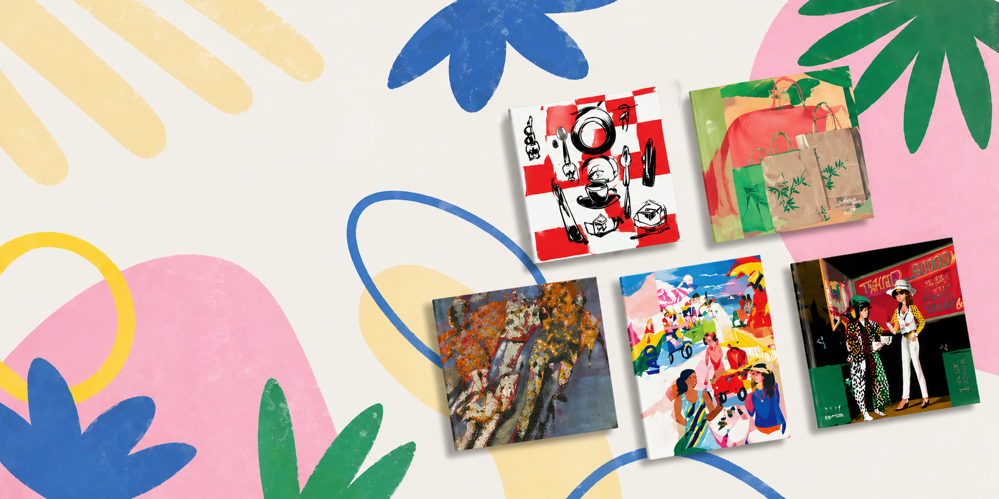

# García de Pou — Contexto para Claude Code

Sitio web corporativo de **García de Pou**, suministros para hostelería y restauración. Proyecto estático (HTML + CSS + JS vanilla) con un sistema de diseño ya establecido que **debe respetarse**.

## Stack

- HTML5 + CSS puro (sin preprocesadores, sin build)
- JS vanilla en `<script>` inline al final del `index.html`
- Dependencias externas vía CDN:
  - **DM Sans** + **Caveat** (Google Fonts)
  - **Swiper 11** (slider hero + slider "Artículos destacados")
  - **GSAP 3 + ScrollTrigger** (marquees; parallax del hero desactivado)

## Estructura de archivos

```
index.html          # home completa — una sola página
styles.css          # todos los estilos, organizados por sección con comentarios ═══
img/
  ambient/          # fotos de ambiente (hostelería, packaging…)
  catalog/          # portada catálogo antigua (no usar)
  catalogo/         # assets del catálogo activos
    hero-01.png     # imagen hero slide catálogo
    banner-portadas.png  # imagen background banner "Un artista en cada portada"
```

No hay framework, no hay router, no hay bundler. Mantenerlo así.

## Sistema de diseño — tokens (definidos en `:root` de styles.css)

### Colores
- `--black: #0A0A0A` — texto principal
- `--white: #FFFFFF`
- `--g50 / g100 / g300 / g500` — escala de grises
- `--blue: #002D72` — **azul corporativo GDP**, primario
- `--blue-80: #1A4490` — hover del azul
- `--blue-10: #EBF0F8` — tinte suave (pill del carrito, acentos)
- `--yellow: #FFD100` — **solo** para ofertas, badges y acentos puntuales. Nunca como color principal.

### Tipografía
- **DM Sans** (300–900) — toda la UI
- **Caveat** (400–600) — script handwritten, solo para acentos decorativos (ej. palabra "personalizados" en banner de diseños)
- Títulos de sección: `font-weight: 900`, `text-transform: uppercase`, `letter-spacing: -.04em`
- Labels / eyebrows: `font-size: 11px`, `font-weight: 600`, `letter-spacing: .14em`, uppercase, color `--g500`
- Body: DM Sans 400

### Layout
- `--container: 100%` — site full-width
- `--gap: clamp(24px, 4vw, 64px)` — padding horizontal del `.wrap`
- `--header-h: 172px`

### Sistema de espaciado — 8-point grid
Todos los espacios, gaps y paddings deben ser **múltiplos de 8** (8, 16, 24, 32, 48, 64, 80, 96…). Excepciones tipográficas menores (2–4px) permitidas solo en detalles de iconografía.

**Gap estándar de grids: `16px`** (usado en `.products-grid`, `.sectors-grid`, `.looks-grid`, `.promo-looks-grid` y en el `spaceBetween` del Swiper). No mezclar 10px, 24px, 2px — todo 16px para mantener ritmo coherente.

### Componentes establecidos (reutilizar, no reinventar)
- `.btn` — base de botón. Siempre combinar con variante de color + tamaño:
  - **Color**: `.btn-blue` (primario, fondo azul) · `.btn-outline-blue` (ghost)
  - **Tamaño**: `.btn-sm` (h 32px) · *(default)* (h 44px) · `.btn-lg` (h 56px)
  - Uso: `<a class="btn btn-blue btn-lg">`. En banners y hero: siempre `btn-lg`. En sección-headers "Ver todos": tamaño default.
- `.offer-card` — card de producto (imagen cuadrada + body con pricing + qty + añadir). **Sin borde** (eliminado).
- `.cat-item` — item de lista de categorías con thumbnail que se revela en hover
- `.sector-card` — card de sector profesional
- `.look-item` — card editorial con overlay de gradiente
- `.cart-pill` — pill del carrito

### Patrones visuales recurrentes
- Bordes `1px solid var(--g100)` para separadores finos
- `border-radius` casi inexistente — diseño angular. Excepciones: botones de iconos circulares (flechas de slider, cart add), pill del carrito (999px)
- Hover en cards: `box-shadow: 0 4px 24px rgba(0,0,0,.07)` + `transform: scale(1.05)` en la imagen con `transition: transform .6s cubic-bezier(.16,1,.3,1)`
- Reveals on-scroll vía `data-reveal` + `data-delay` (IntersectionObserver)

## Secciones del home (orden actual)

1. **Announcement bar** — marquee azul con claims (envío gratis, +10.000 referencias…)
2. **Header** de 3 filas (utility / brand+search / categorías) — sticky con estado `.scrolled` que colapsa a una sola fila con escudo + cats + carrito
3. **Hero** ⭐ — Swiper 3 slides (ver detalle abajo)
4. **Strip** — marquee azul con categorías
5. **Taglines** — par de frases destacadas centradas
6. **Promo looks** — grid editorial de 5 piezas
7. **Offers** — slider Swiper de artículos destacados (`.offer-card`)
8. **Collections** — marquee infinito de logos de marcas
9. **Categories** — lista tipográfica con numeración 01–12 y thumbnails revelables
10. **Sectors** — grid 4×4 de sectores profesionales
11. **Bestsellers** — grid 4 columnas de `.offer-card`
12. **Custom** ⭐ — banner "Diseños personalizados" (ver detalle abajo)
13. **Portadas banner** ⭐ — banner "Un artista en cada portada" (ver detalle abajo)
14. **Looks** — grid editorial 2×2
15. **Trust** — "Generando confianza desde 1884" con 5 pilares

## Hero — slider Swiper (sección `#hero`)

Convertido de split estático a **Swiper 3 slides** con loop y autoplay (6 s).

### Slides (orden actual)
1. **Catálogo 2026** — "Catálogo / *2026* / disponible" · imagen `img/catalogo/hero-01.png` · CTAs: "Solicitar catálogo" + "Ver online"
2. **Hostelería** — "Equipa / *la mejor* / hostelería" · imagen `img/ambient/GDP__DSC8223.jpg` · badge +10K
3. **Take Away** — "Packaging / *sostenible* / para llevar" · imagen `img/ambient/GDP__DSC1692_muntatge biodegradables.jpg` · badge ECO

### Anatomía HTML
```html
<section class="hero" id="hero">
  <div class="swiper hero-swiper">
    <div class="swiper-wrapper">
      <div class="swiper-slide">
        <div class="hero-slide">          <!-- grid 1fr 1fr -->
          <div class="hero-content">…</div>
          <div class="hero-media">…</div>
        </div>
      </div>
      <!-- …más slides… -->
    </div>
    <div class="hero-controls">          <!-- paginación + flechas, lado izquierdo -->
      <div class="hero-pagination"></div>
      <div class="hero-nav">
        <button id="heroPrev">…</button>
        <button id="heroNext">…</button>
      </div>
    </div>
  </div>
</section>
```

### Decisiones técnicas
- `width: 100%` **NO** se aplica a `.swiper-wrapper` — Swiper lo gestiona por JS con inline style.
- `.hero-controls` vive dentro de `.swiper.hero-swiper` pero fuera de `.swiper-wrapper` (patrón correcto de Swiper).
- El parallax GSAP del hero original está **desactivado** (comentado).
- Las IDs antiguas (`#heroTitle`, `#heroMedia`…) ya no existen; las animaciones CSS de entrada quedaron sin efecto y pueden limpiarse.
- `html` tiene `overflow-x: clip` (no `hidden`). **`clip` no crea scroll container** → `position: sticky` del header funciona. **No cambiar esto.** Si se quita, la página vuelve a descentralizarse cuando algún elemento desborda horizontalmente.

---

## Banner "Diseños personalizados" (sección `#custom`)

Ubicado **entre Bestsellers y Looks**. Banner horizontal que promociona el servicio de personalización de productos.

### Anatomía
```html
<section class="custom" id="custom" data-variant="blue">
  <div class="wrap">
    <a href="#" class="custom-banner">
      <div class="custom-pattern">…</div>         <!-- rejilla de iconos SVG de packaging -->
      <div class="custom-badge">…</div>            <!-- badge vertical girado 90° -->
      <div class="custom-copy" style="padding: 0px 0px 0px 3px">
        <h2 class="custom-title">
          <span class="custom-title-bold">Diseños</span>
          <span class="custom-title-script">personalizados</span>   <!-- Caveat -->
          <svg class="custom-underline">…</svg>                     <!-- subrayado amarillo -->
        </h2>
        <p class="custom-sub">…</p>
        <ul class="custom-features">…</ul>          <!-- 3 features con check -->
      </div>
      <div class="custom-cta-wrap">
        <span class="custom-cta">Productos personalizados →</span>
        <span class="custom-cta-hint">+400 referencias disponibles</span>
      </div>
      <span class="custom-corner tl/tr/bl/br"></span> <!-- marcos decorativos -->
    </a>
  </div>
</section>
```

### Decisiones de diseño tomadas
- **Descartado el gradiente multicolor** de la referencia original — no encaja con la sobriedad del resto del site. Se usa el azul corporativo como fondo principal.
- **Iconografía** en SVG line-art reproduce los iconos de packaging del original (bolsa, vaso, cono, fries, hamburguesa, caja, sobre, etc.) definidos con `<defs>` y colocados con `<use>` en rejilla 4×3.
- **Mezcla tipográfica** intencional: "DISEÑOS" en DM Sans 900 uppercase (tono del site) + "personalizados" en Caveat (homenaje al script manuscrito del original).
- **CTA sin animación de desplazamiento** en hover (solo cambio de color blanco → `--blue-80`) — por feedback explícito del usuario ("quitar la animación del hover en el botón porque se mueve todo y molesta").
- **3 variantes** conmutables vía `data-variant` en `.custom`:
  - `blue` (por defecto) — fondo azul corporativo
  - `yellow` — fondo `--g50` con acentos amarillos, título en azul
  - `multicolor` — homenaje al gradiente original con paleta controlada (cian → magenta → amarillo, `mix-blend-mode: screen`)

### Tweaks panel
En `index.html` hay un panel flotante `#tweaks-panel` que permite alternar en vivo las 3 variantes del banner. El estado se persiste en el bloque JSON entre los marcadores `/*EDITMODE-BEGIN*/ … /*EDITMODE-END*/` al inicio del `<script>`.

Si se edita fuera del editor inline, simplemente cambiar `data-variant="blue"` en `<section class="custom">` o la clave `customVariant` en el JSON de defaults.

---

## Banner "Un artista en cada portada" (sección `#portadas-banner`)

Ubicado **entre Custom y Looks**. Banner promocional de la colección de portadas de catálogo.

### Anatomía HTML
```html
<section class="portadas-banner" id="portadas-banner" data-reveal>
  <div class="wrap">
    <div class="portadas-banner-inner">         <!-- position: relative, min-height: 360px -->
      <div class="portadas-banner-copy">        <!-- z-index: 1, flex column, max-width: 520px -->
        <div class="portadas-banner-eyebrow">…</div>
        <h2 class="portadas-banner-title">
          Un artista<br><em>en cada</em> portada
        </h2>
        <a href="#" class="btn btn-blue btn-lg">Ver todas las portadas</a>
      </div>
      <div class="portadas-banner-media">       <!-- position: absolute, inset: 0 -->
        
      </div>
    </div>
  </div>
</section>
```

### Decisiones de diseño
- Imagen como **fondo completo** (`position: absolute; inset: 0; object-fit: cover`) — cubre todo el banner.
- Texto HTML superpuesto (no texto embebido en la imagen) — misma tipografía que el hero (peso 900 uppercase + `<em>` italic 300).
- Botón **siempre `btn-lg`** en este contexto.
- `padding-bottom: 96px` en la sección para mantener el mismo ritmo espacial que el resto del site.
- **Mobile**: columna única, `min-height: 280px`, texto y botón visibles sobre la imagen.

---

## Convenciones a respetar cuando Claude Code edite este proyecto

1. **No introducir frameworks** (React, Vue, Tailwind, etc.) — es HTML/CSS/JS puro a propósito.
2. **Usar tokens de `:root`** — no hardcodear colores. Si hace falta un color nuevo, añadirlo como token.
3. **No usar el amarillo `--yellow` como color principal** — solo acentos.
4. **Mantener el patrón de secciones** — cada sección con su comentario `═══` en CSS y HTML, `id` descriptivo, `.wrap` interior para limitar ancho, `section-title` + `label` eyebrow para los headers.
5. **Reutilizar componentes existentes** (`.offer-card`, `.btn-blue`, etc.) antes de crear nuevos.
6. **Responsive** con media queries estándar: breakpoints ~1100 / 900 / 720 / 600 / 480.
7. **DM Sans primero**. Caveat solo para acentos decorativos muy puntuales.
8. **Reveals on-scroll** — si se añade contenido nuevo, incluir `data-reveal` + `data-delay` opcional (1–6).
9. **Botones en banners y hero siempre `btn-lg`**. En cabeceras de sección ("Ver todos") tamaño default. `btn-sm` solo para acciones secundarias en contextos compactos.
10. **`html { overflow-x: clip }` — no tocar nunca.** Es la única regla que elimina el desbordamiento horizontal sin crear un scroll container. Si se cambia a `hidden` o `visible`, el header sticky puede romperse o la página puede aparecer descentrada. El `body` ya no necesita `overflow-x: hidden` porque `html` lo gestiona.
11. **Imágenes de catálogo en `img/catalogo/`** (sin tilde). No usar `img/catalog/` (carpeta antigua).

## Cómo previsualizar

Abrir `index.html` directamente en el navegador. No hace falta servidor local (las dependencias son todas CDN).

---

## Figma — Generación del sistema de diseño

El objetivo es crear un archivo Figma que refleje fielmente el sistema de diseño del proyecto: variables, componentes y páginas. Usar las herramientas MCP de Figma (`mcp__figma__*`) disponibles en Claude Code.

### Proceso recomendado (en orden)

1. Crear el archivo Figma con `generate_figma_design` o `create_new_file`
2. Definir variables de color y tipografía con `get_variable_defs` / variables
3. Crear componentes atómicos (botones, badges, cards)
4. Componer las páginas (Home, Category PLP)

### Variables de color → Figma

| Token CSS | Hex | Nombre en Figma |
|---|---|---|
| `--black` | #0A0A0A | Color/Black |
| `--white` | #FFFFFF | Color/White |
| `--g50` | #F7F7F7 | Color/Gray/50 |
| `--g100` | #E8E8E8 | Color/Gray/100 |
| `--g300` | #ADADAD | Color/Gray/300 |
| `--g500` | #737373 | Color/Gray/500 |
| `--blue` | #002D72 | Color/Blue/Primary |
| `--blue-80` | #1A4490 | Color/Blue/Hover |
| `--blue-10` | #EBF0F8 | Color/Blue/Tint |
| `--yellow` | #FFD100 | Color/Yellow |

### Variables de tipografía → Figma

| Uso | Font | Weight | Size | Transform |
|---|---|---|---|---|
| Título sección | DM Sans | 900 | 32–48px | UPPERCASE |
| Eyebrow / label | DM Sans | 600 | 11px | UPPERCASE, ls +0.14em |
| Body | DM Sans | 400 | 13–14px | — |
| Acento decorativo | Caveat | 400–600 | variable | — |

### Componentes a crear en Figma

Cada componente debe tener variantes que repliquen los modificadores CSS.

#### Botones — `.btn`
- **Variantes**: Color (`Blue` / `Outline Blue`) × Tamaño (`SM 32px` / `Default 44px` / `LG 56px`)
- Radio: 0 (angular). Icon opcional izquierda/derecha.

#### Product Card — `.offer-card`
- Imagen cuadrada arriba + body abajo (código ref, nombre, rating, precio, pack, qty selector + añadir)
- Variante: con/sin badge descuento (amarillo `--yellow`)

#### Category Pill — `.cat-pill` / `.cat-pill--sm`
- Thumb circular + label. Variante SM (56px alto, 200px ancho) para subcat-bar.

#### Sector Card — `.sector-card`
- Imagen de fondo + overlay azul corporativo + label

#### Look Item — `.look-item`
- Imagen editorial + overlay gradiente negro + título

#### Header — desktop y mobile
- Desktop: 3 filas (utility / brand+search / nav)
- Mobile: hamburger + logo + carrito. Estado `.scrolled` colapsado.
- Cart Pill (`.cart-pill`): pill azul-10 con escudo y contador

#### Hero Slide
- Grid 1fr 1fr: copy (eyebrow + h1 + CTAs) + media (imagen)
- Badge opcional (top-right de media)
- Controls: paginación bullets + flechas

#### Filter Sidebar — `.cat-filter`
- Grupo acordeón: header (nombre + chevron + badge contador) + body
- Tipos de control: checkbox, radio de color (swatch), radio de texto

#### Filter Drawer — mobile
- Bottom sheet: header "Filtrar y ordenar" + body scroll + footer ("Ver X artículos" + "Borrar todo")

#### Banners
- **Custom banner** (`#custom`): fondo azul, rejilla de iconos SVG, título mixto DM Sans + Caveat, features, CTA
- **Portadas banner** (`#portadas-banner`): imagen full-cover + copy superpuesto + botón

### Páginas a generar en Figma

#### 1. Home (`index.html`)
Secciones en orden: Announcement bar → Header → Hero (3 slides) → Strip → Taglines → Promo looks → Offers slider → Collections → Categories → Sectors → Bestsellers → Custom → Portadas banner → Looks → Trust → Footer

#### 2. Category PLP (`category.html`)
Secciones: Header → Cat banner → Subcat bar → [Mobile: filter pill-bar] → Cat section (sidebar + grid + highlight + grid + paginación) → SEO text → Footer

### Convenciones de naming en Figma

- Componentes: `NombreComponente/Variante` — ej. `Button/Blue/LG`, `ProductCard/WithBadge`
- Páginas: `🏠 Home`, `📋 Category PLP`
- Capas: en español, siguiendo los `id` HTML — ej. `#hero`, `.offer-card`, `.cat-sidebar`
- Frames de página: `Desktop 1440` / `Mobile 390`

### Notas para la sesión Figma

- Usar `get_design_context` si hay un archivo Figma existente con URL
- Los tokens de color se mapean 1:1 desde `:root` de `styles.css`
- El espaciado es 8-point grid: usar múltiplos de 8 para todos los gaps y paddings
- `border-radius: 0` en la mayoría de componentes — solo circular en botones de icono y cart-pill
- Las imágenes de producto están en `img/product/` y las ambientales en `img/ambient/`
